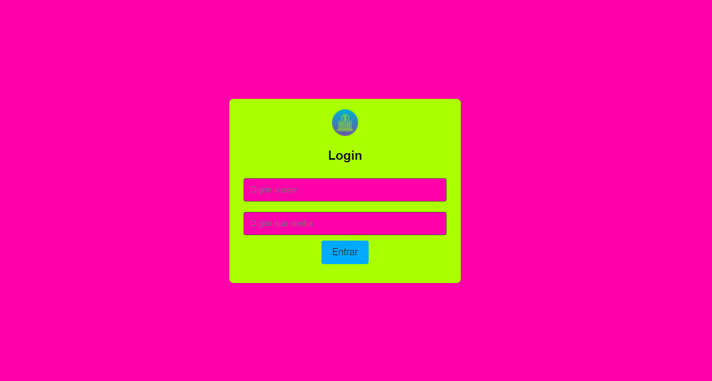

# Trabalho Final Frontend 3000 Talentos

Trabalho final do curso de Programação Frontend do programa 3000 Talentos em TI - Senac São Leopoldo

No projeto final do curso de Frontend com React, aplico conhecimentos para criar uma interface dinâmica. Destaco habilidades na construção de aplicações web modernas com React.

